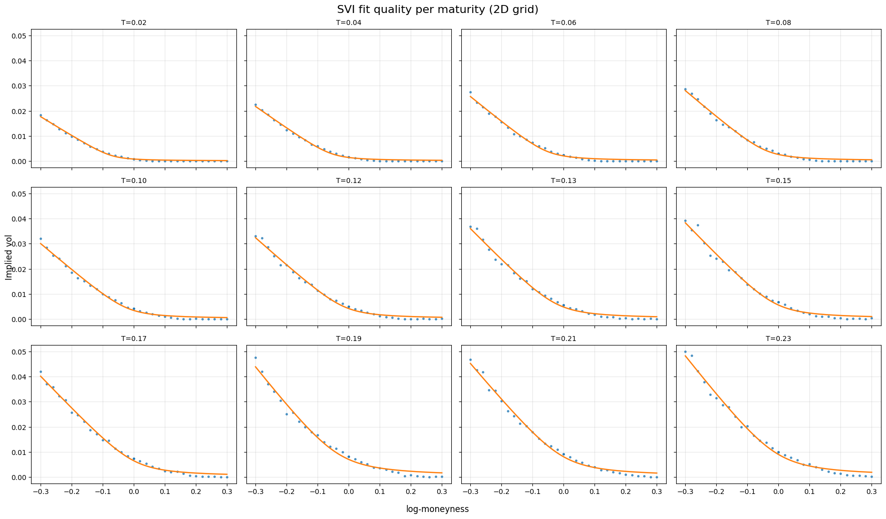
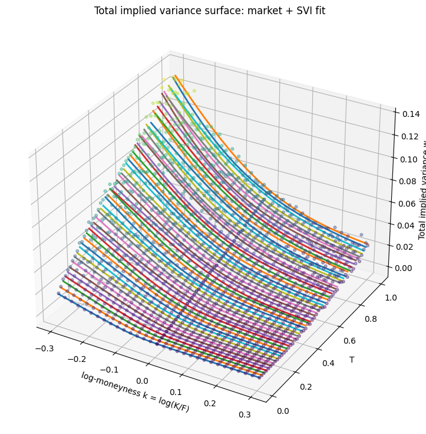

# Dupire Volatility Modeling 

This project aims at modeling local volatility using volatility surface and Dupire's model. 

## Methodology 

This project relies on synthetic data generation (see option_chain_generator.py)

## SVI Fit

From this data, an SVI curve is fitted for each maturity. SVI gives :

$$ w(k) = a + b(\rho (k-m) + \sqrt{(k-m)^2 +\sigma^2)} $$

with :

$w(k)$ : the total variance 

$a$ : minimum total variance

$b$: slope of the curve ($b>0$)

$\rho$: the skew with $\rho \space \epsilon \space(-1,1)$

$m$: center, location of smile minimum

$\sigma$: curvature, with $\sigma > 0$

### Fitting result (first 12 fit)

