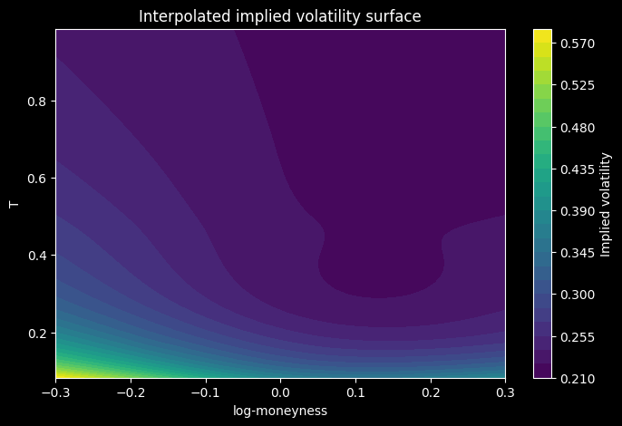
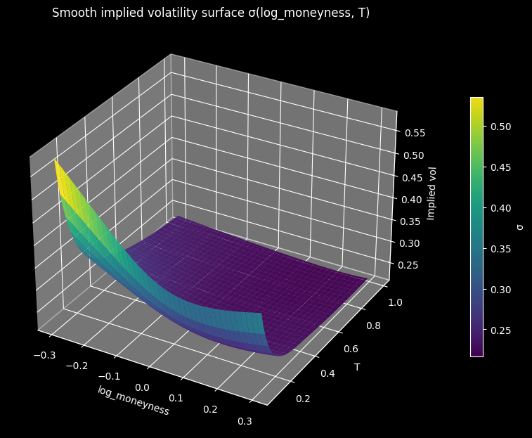
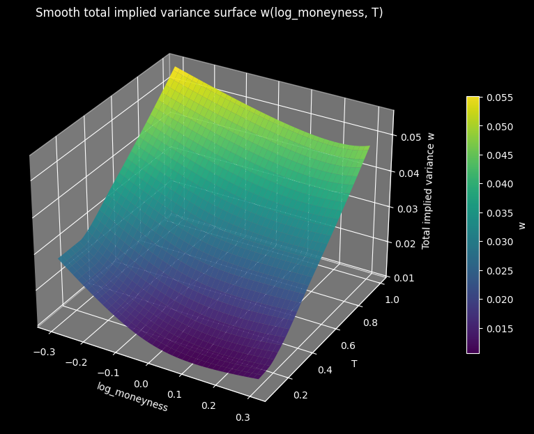
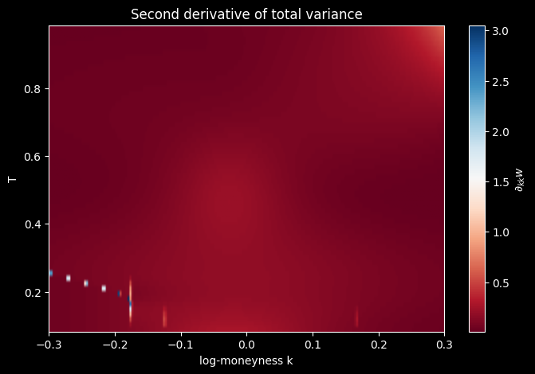

# Dupire Volatility Modeling 

This personal project focuses on the construction of a smooth implied volatility surface and the derivation of a local volatility surface using Dupire’s framework.

## Background

The classical Black–Scholes model assumes that the underlying asset price follows the SDE
$$dS_t = \mu S_t\,dt + \sigma S_t\,dW_t$$
with $\sigma$, the volatility of the underlying asset $S$, assumed to be known and constant. However, empirical analysis shows that when inverting Black-Scholes to solve for $\sigma$, the *implied volatility* obtained depends strongly on the strike price $K$ and the time to maturity $T$ of the option, leading to a curve taking the form of a smile when plotting $\sigma_{iv}$ as a function of $K$ for a given maturity.

In *Pricing with a Smile* (1994), Bruno Dupire proposed a spot process compatible with the smile. The stock price $S$ is assumed to have the following SDE,

$$dS_t = \mu_tS_t\,dt + \sigma_{loc}(k,T)S_t\,dW_t$$

with $k$ the *log-moneyness* calculated as $k = \log(\frac{K}F)$. $\sigma_{loc}(k,T)$ is a deterministic function allowing the computation of the instantaneous volatility for any $(k,T)$. 

The objective of this project is to find the function $\sigma_{loc}(k, T)$ for a given set of synthetically generated option data. 


## Methodology 

**Data generation and exploratory analysis**  
We first generate a synthetic option dataset and perform a preliminary exploratory analysis to inspect the implied volatility smiles across maturities. This step allows us to verify basic stylized facts such as the presence of skew and the term structure of volatility, and to ensure that the data are free of obvious arbitrage inconsistencies.

**SVI calibration and interpolation**  
For each maturity, we calibrate a Stochastic Volatility Inspired (SVI) parametrization to the observed implied volatilities, and expect to find results close to the parameters used for data generation. The calibrated SVI smiles are then interpolated across maturities to obtain a smooth and coherent implied volatility surface.

**Dupire local volatility derivation**  
Finally, we convert the implied volatility surface into a total implied variance surface and apply Dupire’s formula to derive the corresponding local volatility surface.

---

**Notes**  
Some choices were made from the start to ensure stability in the final local volatility surface :  
- The choice of relying on synthetic option data prevents from capturing all the real market features that would normally be observed
- Short maturities (< 30 days) were excluded to ensure that the time derivatives stay stable
- We kept a relatively low number of options for smoother interpolation 

---

**Documents**  
- *demo.ipynb* : contains the workflow  
- *option_chain_generator.py* : the function used to generate the data
- *svi.py* : functions for calculating & fitting SVI curve

You are welcome to download the projet and run the notebook for the interactive 3D visualisation of certain component.

## Data Generation

Data is generated from the make_synth_iv_chain_svi() function (code and comments are in option_chain_generator.py). 

The option chain used in the following notes has been generated with parameters :

```python
S0=100.0, 
r=0.02,
q=0.00,
maturities_day = (30, 60, 90, 180, 270, 360),
k_min=-0.30, 
k_max=0.30, 
n_k=31,
seed=0
```

We obtain data that present a visible smile (feel free to check the Jupyter notebook for interactive 3D plots).


## SVI Fit

We start from the SVI model, which models the total implied variance with the following formula :

$$ w(k) = a + b(\rho (k-m) + \sqrt{(k-m)^2 +\sigma^2} $$

with :
***
$w(k) \text{: the total variance} $

$a : \text{minimum total variance} $

$b: \text{slope of the curve (b>0)}$

$\rho \text{: the skew with}$ $\rho \in (-1,1)$

$m: \text{center, location of smile minimum}$

$\sigma: \text{curvature, with}$ $\sigma > 0$  

***

Note : the **[svi_interactive.html](interactive_plots/svi_interactive.html)** file allows to play with the SVI parameters and visualize the resulting curve.

Our goal is to determine, for each unique maturity in our data, the SVI parameters that yield the best fitting curve for total variance ($w(k) = \sigma^2 * T$). This was done using the `scipy.optimize.least_square` method on the residual (please see svi.py for details about the implementation). 

### Fit results


Given that our data is originally generated from an SVI curve[^1], we find good fits (see [the interactive 3D plot](interactive_plots/svi_fit.html))

## Interpolation    

Dupire's formula is the following :


$$
\sigma_{\mathrm{loc}}^{2}(k,T)=\frac{\partial_T w}{1-
\frac{k}{w}\,\partial_k w+\frac{1}{4}\left(-\frac{1}{w}+
\frac{k^{2}}{w^{2}}\right)(\partial_k w)^2+
\frac{1}{2}\,\partial_{kk} w}
$$

with :  

---
$\sigma_{\mathrm{loc}}(k,T) \text{ : local volatility}$

$k = \log\!\left(\frac{K}{F_T}\right) \text{with: }$  

$F_T = S_0 e^{(r-q)T}$  

$\sigma_{\mathrm{imp}}(k,T) \text{ : implied volatility}$  

$w(k,T) = \sigma_{\mathrm{imp}}^2(k,T)\,T$

$\partial_T w \text{ : partial derivative of } w(k,T) \text{ with respect to }T \text{ at fixed }k$

$\partial_k w \text{: partial derivative of } w(k,T) \text{ with respect to }k \text{ at fixed }T$

$\partial_{kk} w \text{: second partial derivative of } w(k,T) \text{ with respect to }k \text{ at fixed }T$

---
The main challenge in interpolation is to obtain a total variance surface that keeps $\partial_{kk} w$ as stable as possible. In addition, the surface must respect basic no-arbitrage principles; here this translates as the fact that total implied variance must grow with time in the interpolation. We aim to interpolate in a way that that keep the derivatives as stable as possible and preserve the shape of the data. 

We used the `PchipInterpolator` from `scipy` in order to interpolate between maturities. The result is shown in the following figures : 


### Implied Volatility Surface





### Total Implied Variance Surface



## Local Volatility

From the total implied variance surface, we apply Dupire's formula to derive 




### Thank you for reading
You are welcome to download the project and run the notebook to explore the interactive 3D visualizations


### Notes
---
[^1]: We can observe higher noise in the total implied variance for higher maturities. This is a consequence of the synthetic generation process. Since noise is added on $\sigma_{iv}$ (see *option_chain_generator.py*, l.78), computing total variance $w(k, T)$ as $\sigma_{iv}^2 * T$ amplifies the noise as $T$ increases.