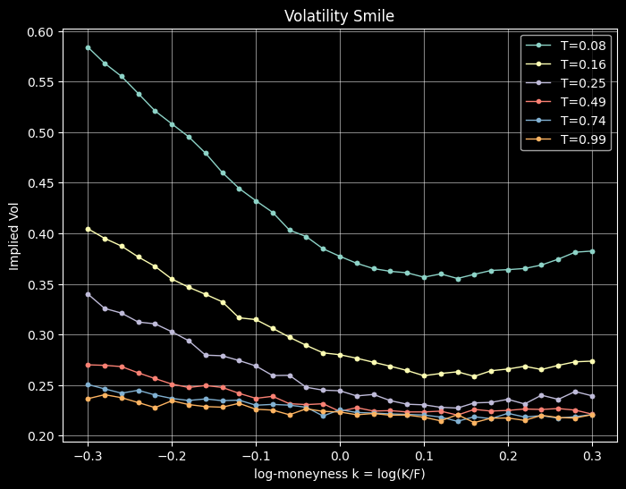
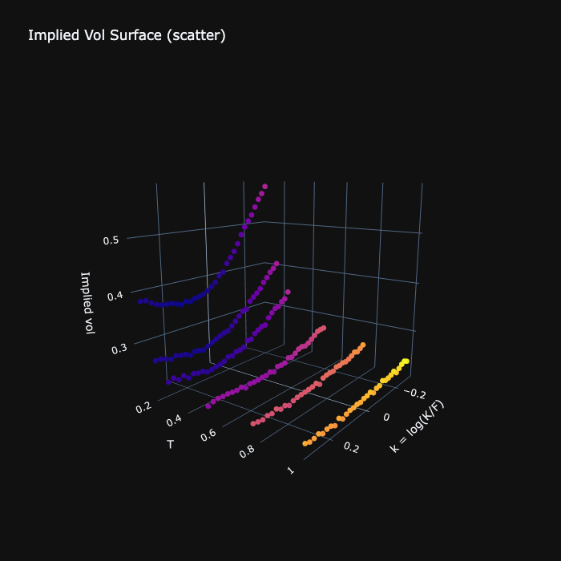
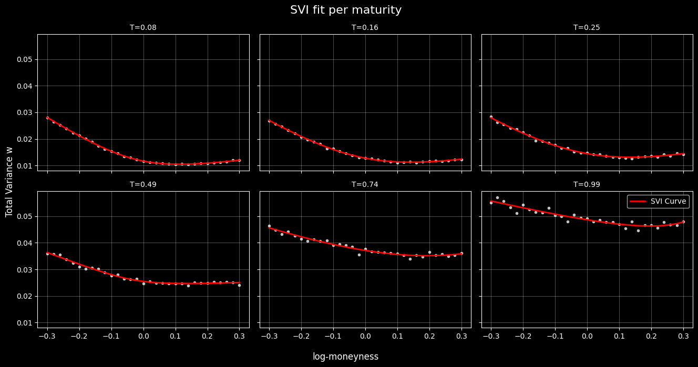
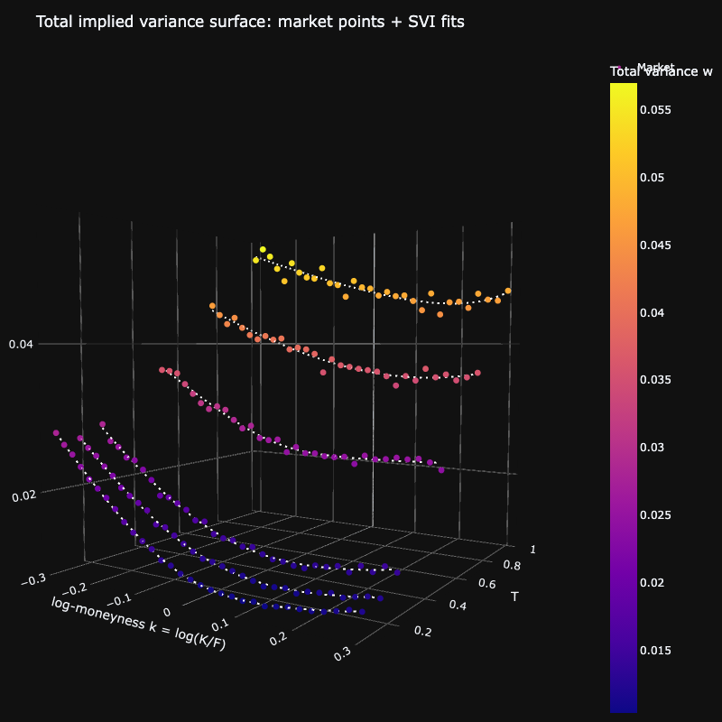

# Dupire Volatility Modeling 

This project aims at modeling local volatility using volatility surface and Dupire's model. 

## Methodology 

**Data generation and exploratory analysis**  
We first generate a synthetic option dataset and perform a preliminary exploratory analysis to inspect the implied volatility smiles across maturities. This step allows us to verify basic stylized facts such as the presence of skew and the term structure of volatility, and to ensure that the data are free of obvious arbitrage inconsistencies.

**SVI calibration and interpolation**  
For each maturity, we calibrate a Stochastic Volatility Inspired (SVI) parametrization to the observed implied volatilities. The calibrated SVI smiles are then interpolated across maturities to obtain a smooth and coherent implied volatility surface. Particular attention is paid to preserving stability and avoiding spurious oscillations.

**Dupire local volatility derivation**  
Finally, we convert the implied volatility surface into a total implied variance surface and apply Dupire’s formula to derive the corresponding local volatility surface, which is suitable for further pricing and risk analysis.

---

**Notes**  
Some choices were made from the start to ensure stability in the final local volatility surface :  
- The choice of relying on synthetic option data prevents from capturing all the real market features that would normally be observed
- Short maturities (< 30 days) were excluded to ensure that the time derivatives stay stable
- We kept a relatively low number of options for smoother interpolation 

---

**Documents**  
- *demo.ipynb* : contains the workflow  
- *option_chain_generator.py* : the function used to generate the data
- *svi.py* : functions for calculating & fitting SVI curve

You are welcome to download the projet and run the notebook for the interactive 3D visualisation of certain component.

## Data Generation

Data is generated from the make_synth_iv_chain_svi() function (code and comments are in option_chain_generator.py). 

The option chain used in the following notes has been generated with parameters :

```python
S0=100.0, 
r=0.02,
q=0.00,
maturities_day = (30, 60, 90, 180, 270, 360),
k_min=-0.30, 
k_max=0.30, 
n_k=31,
seed=0
```

We obtain data that present a visible smile (feel free to check the Jupyter notebook for interactive 3D plots).




## SVI Fit

We start from the SVI model, which gives the following equation :

$$ w(k) = a + b(\rho (k-m) + \sqrt{(k-m)^2 +\sigma^2)} $$

with :
***
$w(k)$ : the total variance 

$a$ : minimum total variance

$b$: slope of the curve ($b>0$)

$\rho$: the skew with $\rho \space \epsilon \space(-1,1)$

$m$: center, location of smile minimum

$\sigma$: curvature, with $\sigma > 0$

***

Note : the **[svi_interactive.html](svi_interactive.html)** file allows to play with the SVI parameters and visualize the resulting curve.

Our goal is to determine, for each unique maturity in our data, the SVI parameters that yield the best fitting curve. This was done using the `scipy.optimize.least_square` method on the residual (please see svi.py for details about the implementation). 

### Fit results






## Interpolation

