# Dupire Volatility Modeling 

This personal project focuses on the construction of a smooth implied volatility surface and the derivation of a local volatility surface using Dupire’s framework.

## Background

The classical Black–Scholes model assumes that the underlying asset price follows the SDE

$$dS_t = \mu S_t\,dt + \sigma S_t\,dW_t$$

with $\sigma$, the volatility of the underlying asset $S$, assumed to be known and constant. However, empirical analysis shows that when inverting Black-Scholes to solve for $\sigma$, the *implied volatility* obtained depends strongly on the strike price $K$ and the time to maturity $T$ of the option, leading to a curve taking the form of a smile when plotting $\sigma_{iv}$ as a function of $K$ for a given maturity.

In *Pricing with a Smile* (1994), Bruno Dupire proposed a spot process compatible with the smile. The stock price $S$ is assumed to have the following SDE,

$$dS_t = \mu_tS_t\,dt + \sigma_{loc}(K,T)S_t\,dW_t$$

$\sigma_{loc}(K,T)$ is a deterministic function allowing the computation of the instantaneous volatility for any strike $K$ and maturity $T$. 

The objective of this project is to find the function $\sigma_{loc}(K, T)$ for a given set of option quotes.

## Methodology 

**Data retrieval and preparation**  
The selected instruments are European call options on S&P 500 ETFs, retrieved using `yfinance`. Although the underlying market is liquid, data from `yfinance` can be noisy and occasionally unreliable; this first step therefore focuses on cleaning the dataset to retain quotes with the highest signal-to-noise ratio.

**SVI calibration and interpolation**  
For each maturity, we calibrate a Stochastic Volatility Inspired (SVI) parametrization to the observed implied volatility. We then proceed to interpolate between each maturity curve to derive an implied volatility surface.

**Dupire local volatility derivation**  
Finally, we visualize the implied volatility and total implied variance surface and apply Dupire’s formula on the $C(K,T)$ surface to derive the corresponding local volatility surface.

---

**Notes**  
Some remarks about the choices and terms used throughout this work :
- the *market price* as referred in the notebook and in this readme is defined as the midpoint between the ask and bid price : $$C_{market} = \frac{C_{ask} + C_{bid}}{2}$$
- log-moneyness $k$ is calculated as :
$$ k = \log(\frac{K}F) \\

with \space F = S \times e^{rT}
$$
- total variance $w$ is calculated as :
$$
w = \sigma_{imp \space vol}^2 \times T_{years}
$$
- the maturities chosen are 1M, 2M, 3M, 6M, 8M and 1Y as of the date of writing of this project (january 2026). The corresponding data used can be found in the "SPY_option_chain.csv" file.
- we assume the risk-free rate to be constant throughout maturities, and equal to 2%. 
- some of the calculations and data manipulations rely on tools developed in a separate module. The original code can be found in the [qtools repository](https://github.com/fantinsib/qtools), but this module may evolve over time and some functions may change their behavior. For the sake of reproducibility, a snapshot of the code as it existed at the time of development is included in the `qtools` folder of this repository to ensure that all results can be reproduced exactly.

All plots are available on [this link](https://fantinsib.github.io/dupire/). Alternatively, you are welcome to download the projet and run the notebook for the interactive 3D visualisation of certain components. 

## Data Retrieval

The option chain used has been retrieved through the `fetch_option_data` function of the `option.py` module in qtools. This function serves as a wrapper around the yfinance API, and simply loads the data in a pandas.DataFrame, adding a column "S" for the price of the spot at the moment the function is ran. After computing the IV, a rapid plot of the smile gives the following for each maturity :

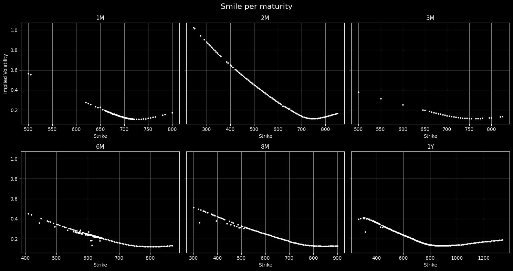

## Data Cleaning

In order to keep only reliable option data, two rules were applied:

### Preliminary cleaning

---

Only options with log-moneyness in $[−0.2,0.2]$ and a relative bid–ask spread below 20% were kept to ensure adequate liquidity.

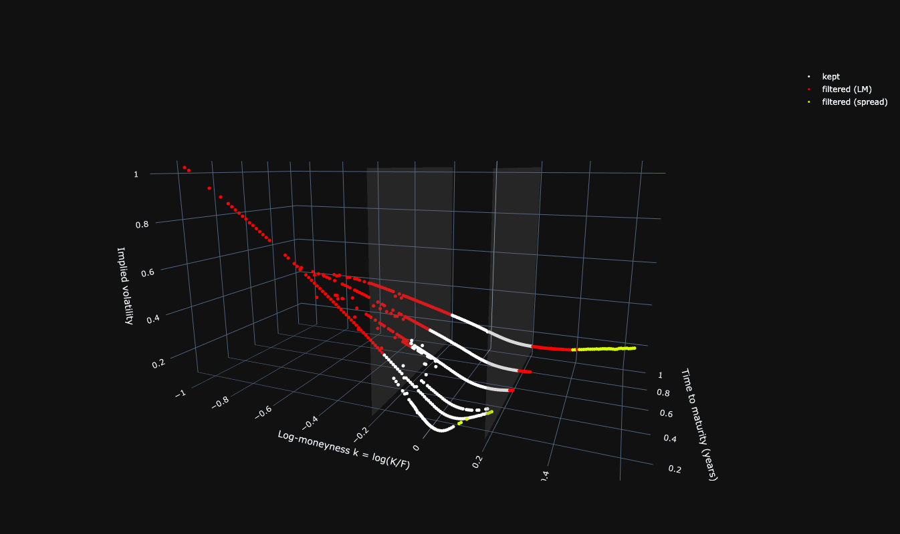

### $C(K)$ and $w(k)$ derivatives

---

As the plot of $C(K)$ showed irregularities in the curve, the first derivative of the price with respect to strike was calculated and is shown for each maturities in the following graph.

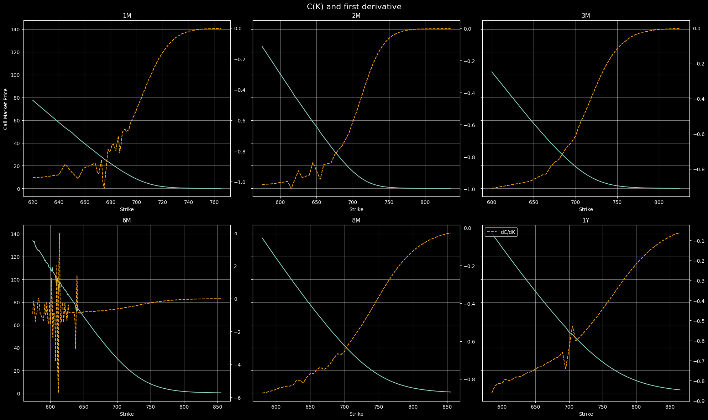

These plots exhibit important features, as they show clear irregularities. The price of a call option is expected to decrease as the strike increases. Hence, in the absence of arbitrage, the first derivative $\partial_C / \partial_K$ of the price w.r.t the strike should be a monotically increasing function. As we can see above, our data shows numerous spots with numerical inconsitencies.

In addition, given the above, the second derivative $\partial_C^2/\partial_{K^2}$ which corresponds to the risk-neutral density of the underlying asset at maturity, is expected to be a non-negative function. This condition is clearly violated in multiple regions of the strike space :

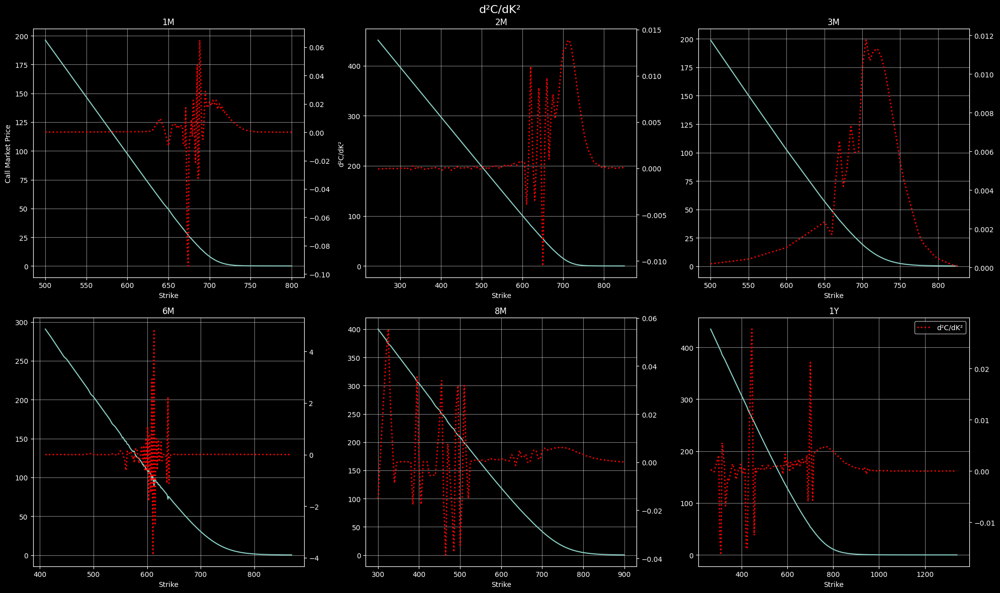

To further analyse the impact of these irregularities, we plotted the total variance ($w = \sigma_{imp \space vol}^2 \times T_{years}$) as a function of log-moneyness ($k = \log \frac{K}{F}$). 

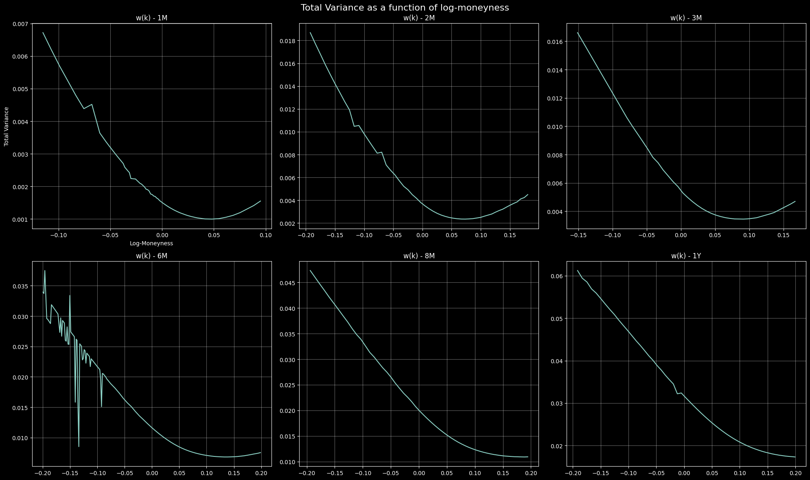

Consitently with the plots of $C(K)$ and its derivatives, the total variance surface exhibits pronounced local irregularities. These issues are particularly severe for the maturity T=6M, which appears to be the most problematic across all representation.

### Spline Smoothing

In order to filter our data points for our SVI fit, we will proceed to fit a spline smoothing seeking to reproduce the dynamic of the relationship and obtain a numerical baseline, before filtering points based on their inconsistency with the fit. We chose the univariate spline algorithm from `scipy`.

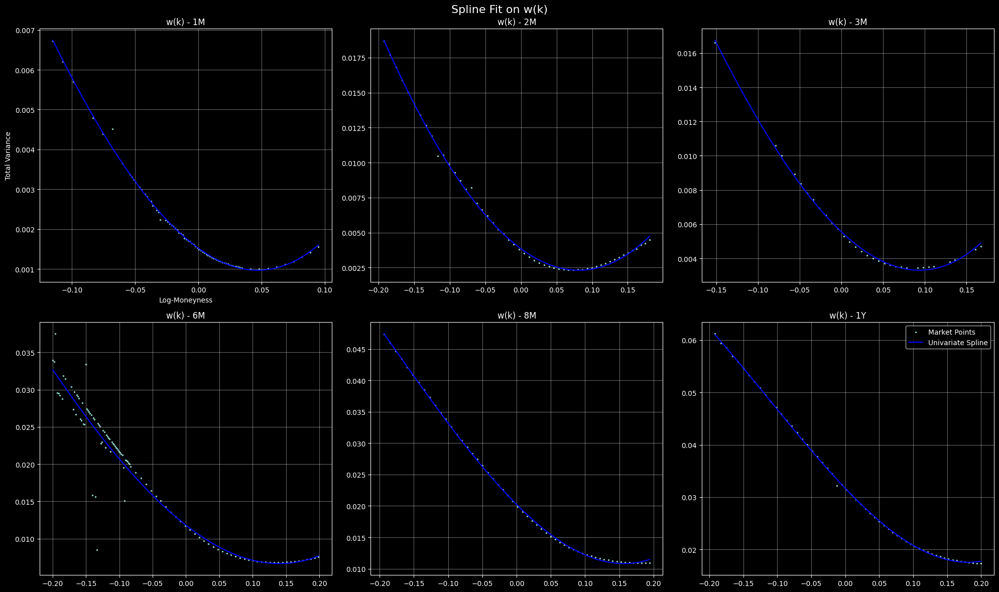

Subsequently, we calculated the MAD (Median Absolute Deviation). Starting with the normalised residuals for market point $i$,

$$ r_i = \frac{w_i - \hat w_{spline}(k_i)}{\hat w_{spline}(k_i)}$$

Normalization ensures that residuals are measured in relative terms, so that deviations in the wings where the level of total variance is higher are not given disproportionate weight compared to near-ATM points. The MAD is then given by

$$ MAD = median(|r_i - median(r_i)|)$$

And we then filter each market quote $i$ on the condition that :

$$|r_i - median(r_i)| \le c \times MAD$$

Where the coefficient $c$ was here set to 4.

---

After applying this filtering, our final working dataset of quotes is the following : 

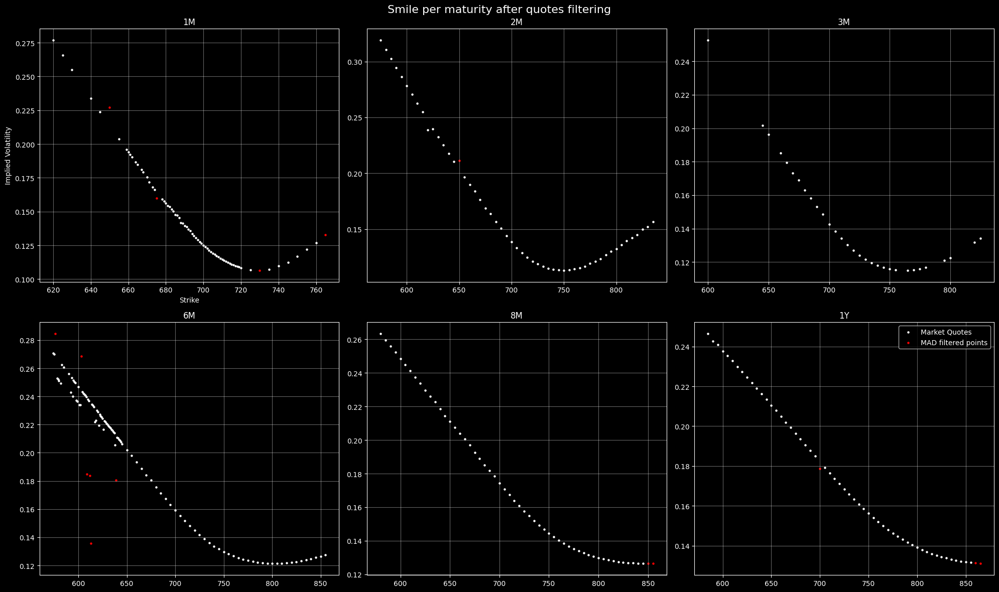

## SVI Fit

We start from the SVI model, which models the total implied variance with the following formula :

$$ w(k) = a + b(\rho (k-m) + \sqrt{(k-m)^2 +\sigma^2}\space) $$

with :
***
$w(k) \text{: the total variance} $

$a : \text{minimum total variance} $

$b: \text{slope of the curve (b>0)}$

$\rho \text{: the skew with}$ $\rho \in (-1,1)$

$m: \text{center, location of smile minimum}$

$\sigma: \text{curvature, with}$ $\sigma > 0$

***

Note : **[this page](https://fantinsib.github.io/dupire/svi_interactive.html)** allows to play with the SVI parameters and visualize the resulting curve.

Our goal is to determine, for each unique maturity in our data, the SVI parameters that yield the best fitting curve for total variance ($w(k) = \sigma^2 * T$). This was done using the `fit_svi()` function in qtools.svi. This function relies on the `scipy.optimize.least_square` method.

### Fit methodology

In the first fit, we followed a "naive" fit, without any regularization. For the sake of comparison, we also perfomed a normalized weighted fit.

- The first "naive fit" for the parameters simply minimzes the unweighted squared error between $\hat w(k_i, \theta)$, the SVI-calculated total variance for market quote with log moneyness $k_i$ and SVI parameters $\theta$ and the target total variance $w_i$, observed from market points. The calibration problem therefore is :

$$ \min_{\theta} \sum_{i} (\hat w(k_i, \theta) - w_{i})^2$$

with $$ \theta = (a, b, \rho, m, \sigma)$$

- In the second approach, we normalise the squared residual and a add a weight vector $\omega$ to svi_fit(). We also add a stabilisation parameter $\lambda$ in order to prevent excessively large normal residuals when the target variance is small. The residual function to minimize becomes
$$\min_{\theta} \sum_i \omega_i \left(\frac{\hat w(k_i, \theta) - w_{i}}{\max(w_{i}, \epsilon) + \lambda} \right )^2$$

with $\epsilon > 0$ to ensure numerical stability and $\omega$ a weight vector passed to the function.

For the weight vector, we will take into account two considerations : favor options that are near ATM and options with lower spread to give more importance to cleaner quotes. Our weight vector hence will be 

$$ \omega_i = \omega_i^{spread} \times \omega_i^{ATM} $$

with:
$$ \omega_i^{spread} = \frac{1}{\epsilon + (rs_i) ^{2}} $$

$rs_i$ being the relative spread of option $i$

And

$$\omega_i^{ATM} = exp(-\frac{k_i^{2}}{2\sigma_k^{2}}) $$

### Fit results

**Naive fit**

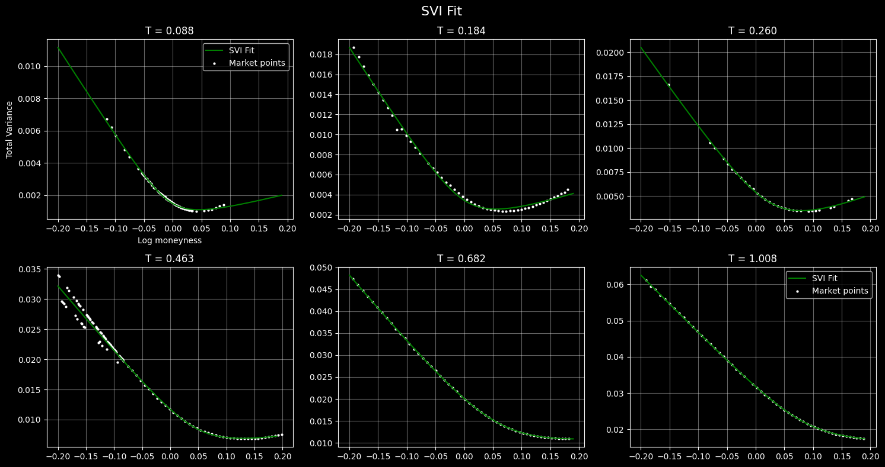

**Regularized fit**

With $\epsilon$ set to $1e-6$, and $\lambda$ set to be the median of the target total variance $w_i$ :

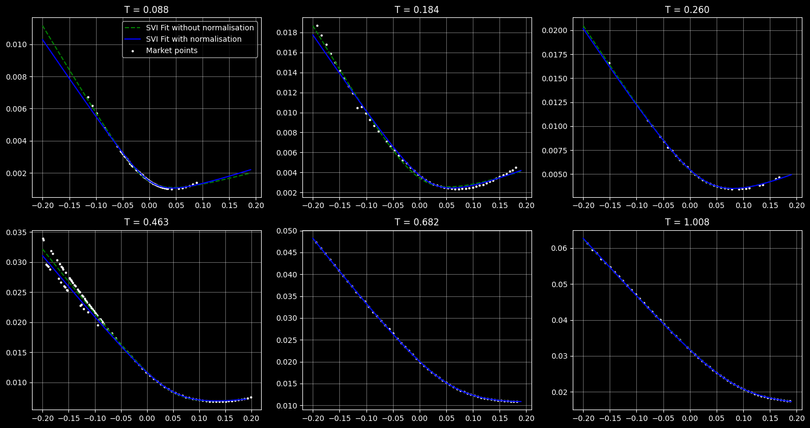

One of the limitation of SVI, which explains why SSVI is usually preferred, is that the model does not enforce a time structure across maturities. If each maturity is fit independantly, SVI can result in calendar spread arbitrage, if the monotonicity condition $\partial_T C(K,T) \ge 0$ is violated. 

This is therefore something that must be verified a posteriori. Calculating the Black-Scholes call price $C$ from the normalized SVI-obtained volatility and calculating the time derivative, we plot the following heatmap : 

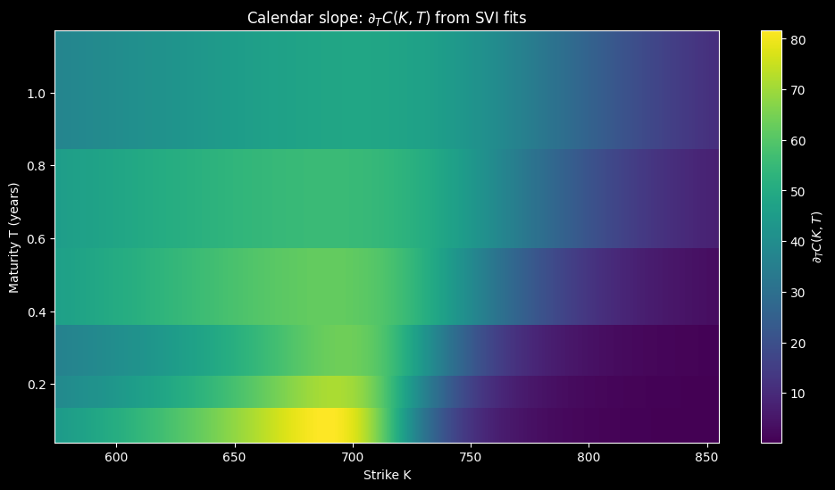

The result indicates that the fitted SVI surface does not exhibit calendar spread arbitrage over the considered range of strikes and maturities.

## Interpolation

Dupire's formula is the following :

$$

\sigma_{loc}^2(K,T) = \frac{\partial_T C(K,T) + r(T)\space K\space \partial_K C(K,T)}{\frac{1}{2} K^2 \partial_{KK} C(K,T)}

$$

with : 

---
$\sigma_{loc}^2(K,T) \text{ : local variance}$

$r(T) \text{: the term structure of the risk-free rate}$

$\partial_T C(K,T) \text{ : partial derivative of } C(K,T) \text{ with respect to }T \text{ at fixed }K$

$\partial_K C(K,T) \text{: partial derivative of } C(K,T) \text{ with respect to }K \text{ at fixed }T$

$\partial_{KK} C(K,T) \text{: second partial derivative of } C(K,T) \text{ with respect to }K \text{ at fixed }T$

Note : given that we assumed $r$ having a flat term structure, it is therefore constant across maturities: $r(T) = 0.02 \space \space \forall T$.

---
The main challenge in interpolation is to obtain a $C(K,T)$ surface that keeps the second derivative with respect to strike, $\partial_{KK} C(K,T)$, as stable as possible. In addition, the surface must respect basic no-arbitrage principles; here this translates as the fact that the call price must be non-decreasing in maturity in the interpolation ($\partial_T C(K,T) \ge 0 $). We aim to interpolate in a way that keep the derivatives as stable as possible and preserve the shape of the data. 

As the normalized SVI fit yields slightly lower errors for near-ATM market quotes, we rely on the corresponding implied volatility surface for interpolation. Using the SVI-derived volatility, Black–Scholes call prices are computed for each maturity on a fixed strike grid $K$ :

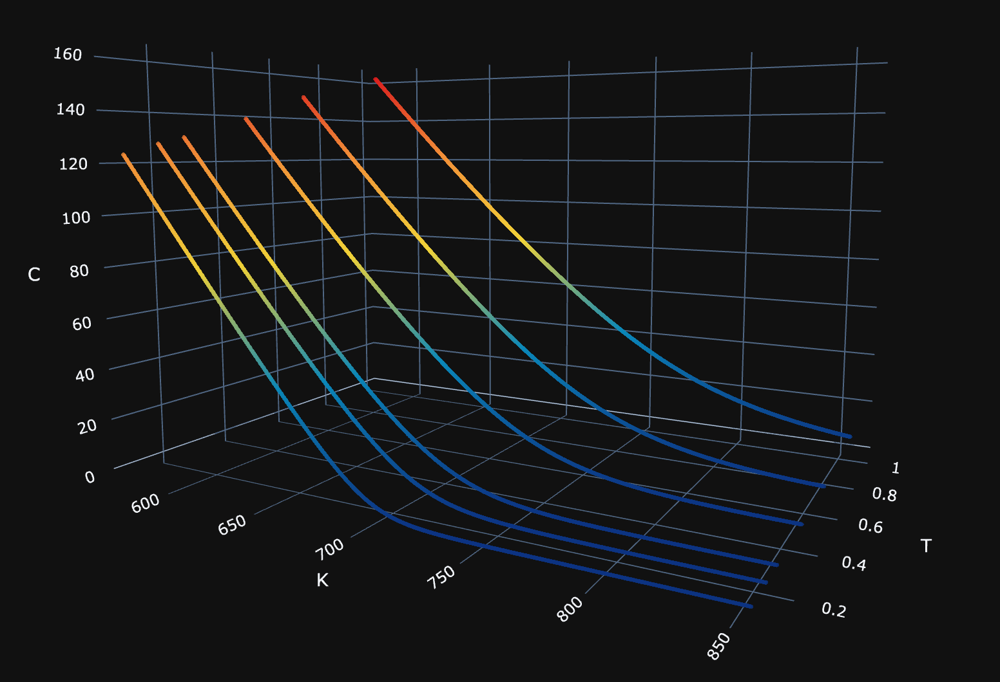

The resulting call price curves $C(K,T)$ are then interpolated across maturities to obtain a smooth dependence in $T$.  We used the `PchipInterpolator` from `scipy` in order to interpolate; this choice is motivated by the fact that PCHIP interpolation preserves moniticity and avoids overshooting between maturities, maintaining the shape of the original data. Plotting the heatmap of $\partial_T C(K,T)$ afterwards gives the following :

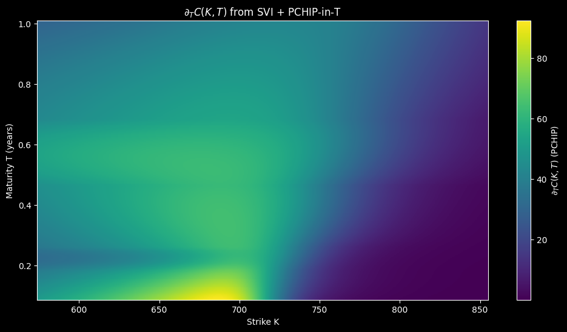

Which shows no apparent violation of the monotonicity condition $\partial_T C(K,T) \ge 0$ after interpolation. 

### Volatility Surface

From there, we calculate the implied volatility surface :

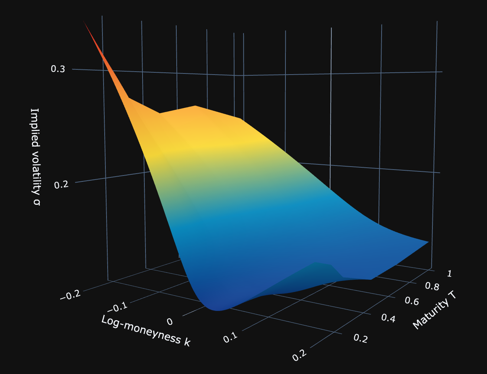

And we then compute the total implied variance surface :

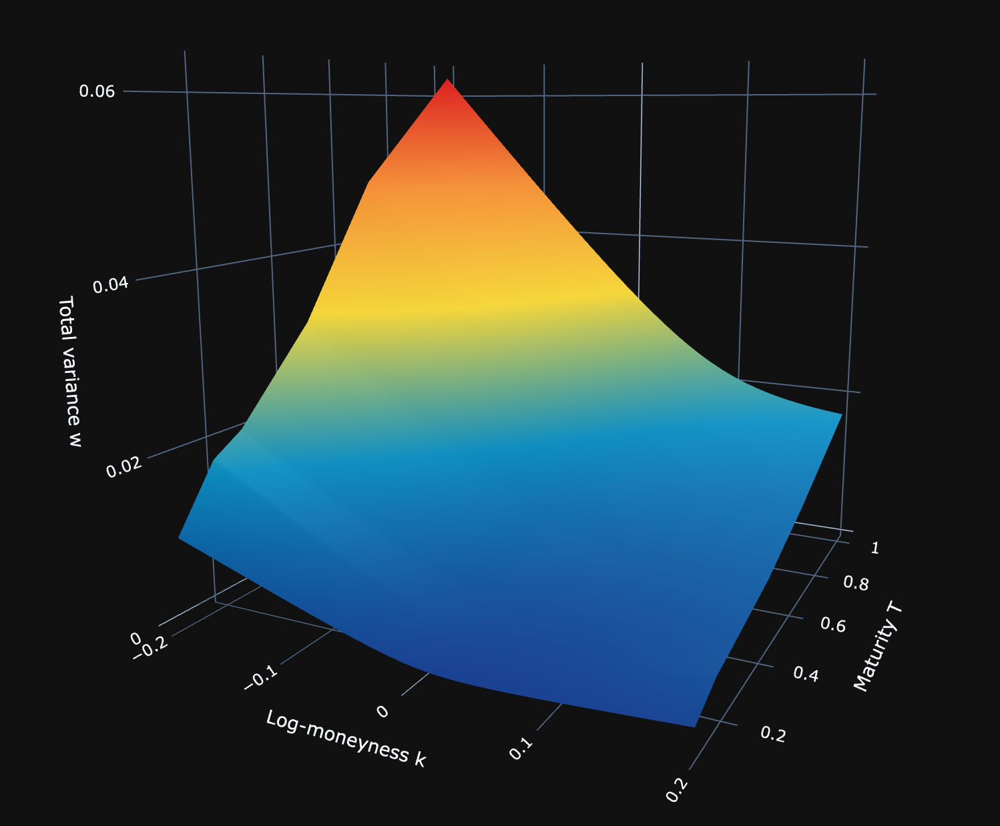

---

## Local Volatility

From our $C(K,T)$ surface, we apply Dupire's formula for $C(K,T)$ to derive the local volatility. 

### Derivative Calculations

We computed the derivatives using central finite difference scheme :

---
***Time Derivative***

*Inside points:*

$$\partial_T C(K, T_i) \approx \frac{C(K, T_{i+1}) - C(K, T_{i-1}) }{T_{i+1} -T_{i-1}}$$

*Borders:*  

$$\partial_T C(K, T_0) \approx \frac{C(K, T_{1}) - C(K, T_{0}) }{T_{1} -T_{0}}$$

$$\partial_T C(K, T_N) \approx \frac{C(K, T_N) - C(K, T_{N-1})}{T_N -T_{N -1}}$$

with $N$ the num of maturities in the grid

---

***Strike Derivatives***

**First order derivative**

*Inside points:*

$$\partial_K C(K_j, T) \approx \frac{C(K_{j+1},T ) - C(K_{j-1},T) }{K_{j+1} -K_{j-1}}$$

*Borders:*

$$\partial_K C(K_0, T) \approx \frac{C(K_{1},T) - C(K_{0},T) }{K_{1} -K_{0}}$$

$$\partial_K C(K_M, T) \approx \frac{C(K_M, T) - C(K_{M-1},T) }{K_{M} -K_{M-1}}$$

with $M$ the num of log-moneyness points

**Second order derivative**

$$\partial_{KK} C(K_j, T) \approx \frac{C(K_{j+1},T) - 2C(K_j, T) + C( K_{j-1}, T)}{h^2}$$

with $h$ the step in the strike grid (since it was generated using the np.linspace function, the grid is uniform by construction)

For borders, we used flat extensions.

---

## Results

The second derivative appears relatively stable. More importantly, the heatmap indicates no violation of the static arbitrage condition in strike ($\partial_{KK}C(K,T) \ge 0$). The implied risk-neutral density is concentrated around short maturity, near-ATM strike, which is economically consistent. 

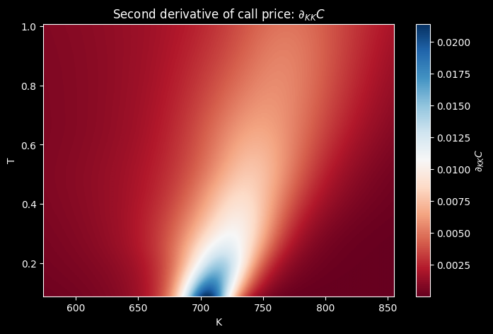

### Dupire Local Volatility Surface
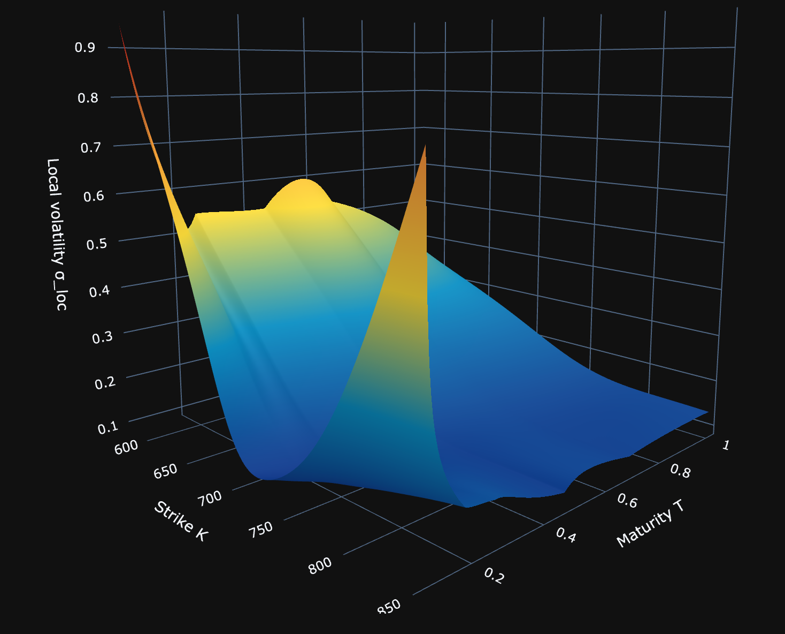

The resulting [local volatility surface](https://fantinsib.github.io/dupire/dupire_surface.html) is positive and continuous across strikes and maturities, indicating that the Dupire construction is well-defined on the considered domain. The surface exhibits higher local volatility levels around near-ATM strikes, particularly at short maturities, while flattening as maturity increases. Sharp local variations can be observed in the wings, which are a well-known feature of local volatility models and reflect the high sensitivity of Dupire’s formula to the second derivative of call prices. These effects do not indicate arbitrage but rather highlight the intrinsic instability of local volatility outside the most liquid regions of the smile.

### Thank you for reading
All contribution proposals & comments are always welcome!
